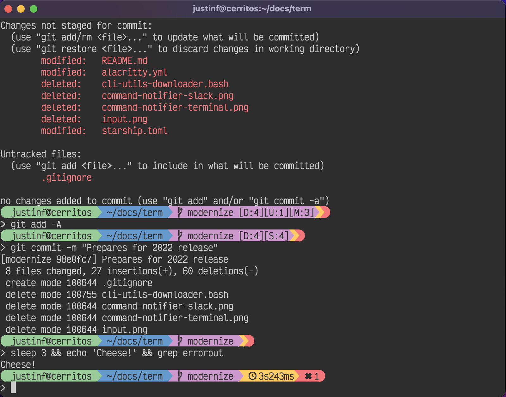

# Term

There are many like it, but this one is mine.

## Font

I use [input](http://input.fontbureau.com/). Their license prohibits me from redistributing my customizations, but I can show the settings I used on their download page:

## Terminal colours

I use the [base16](https://github.com/chriskempson/base16-gnome-terminal) tomorrow dark colour theme in gnome terminal.

### Debian (and potentially debian derivatives)

1. `sudo apt-get install uuid-runtime dconf-cli`
1. Create a profile called "Default", and switch to it as the default. This profile needs to be present for the installation script to work, for some reason. You can delete it afterwards.

### Installation

1. Install the colour theme, but as a warning, the following command has been known to close the terminal: `source base16-gnome-terminal/base16-default.dark.sh`

## Shell

I use [oh my zsh](https://github.com/robbyrussell/oh-my-zsh), with my own theme file: [justinf.zsh-theme](justinf.zsh-theme)
