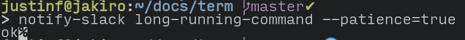

# Term

There are many like it, but this one is mine.

## Font

I use [input](https://input.djr.com/download/). Their license prohibits me from redistributing my customizations, but I can show the settings I used on their download page:

## Terminal colours

I use the [base16](https://github.com/chriskempson/base16-gnome-terminal) tomorrow dark colour theme in gnome terminal.

### Workarounds for debian (and potentially debian derivatives)

1. You need to install some tools that are used by the shellscripts for installing the theme: `sudo apt-get install uuid-runtime dconf-cli`
1. Create a profile called "Default", and switch to it as the default. This profile needs to be present for the installation script to work, for some reason. You can delete it afterwards.

### Installation

1. Install the colour theme, but as a warning, the following command has been known to close the terminal: `source base16-gnome-terminal/base16-tomorrow.dark.sh`

## Shell

I use [oh my zsh](https://github.com/robbyrussell/oh-my-zsh), with a pretty tiny [.zshrc](zshrc). My config includes:
* my own theme file: [justinf.zsh-theme](justinf.zsh-theme), installed to ~/.oh-my-zsh/custom/themes
* The [auto suggestions plugin](https://github.com/zsh-users/zsh-autosuggestions).

### Slack notifications

If you export SLACK_HOOK_URL in your .zshrc-private or otherwise make it available in your environment, the .zshrc will make `write-slack` and `notify-slack` available. `notify-slack` is a helper for long-running commands that can notify you by sending you a DM from yourself when the wrapped command finishes. You can use it by simply prepending `notify-slack` on the beginning of your command, like this:

Which will send you a message in slack that looks like this:

You'll need an incoming webhook url for your desired workspace in order for this to work. See about how to get one here: https://api.slack.com/incoming-webhooks#create_a_webhook

### Improved cli utilities

My zshrc aliases several improved cli utilities if they're found in the path:

* [`lsd`](https://github.com/Peltoche/lsd#description), which replaces `ls`
	* You'll need a patched nerd-font or font-awesome: https://github.com/Peltoche/lsd#prerequisites
		* Since it's not legal to redistribute Input, you can't get a pre-patched version of it. I had to patch it myself: https://github.com/ryanoasis/nerd-fonts#option-8-patch-your-own-font
* [ripgrep (`rg`)](https://github.com/BurntSushi/ripgrep#ripgrep-rg), which replaces `grep`
* [`fd`](https://github.com/sharkdp/fd#fd), which replaces `find`
* [`bat`](https://github.com/sharkdp/bat#syntax-highlighting), which replaces `less`

I have included `cli-utils-downloader.bash` as a way to download the latest releases of these apps for linux and put them in `~/bin`.
